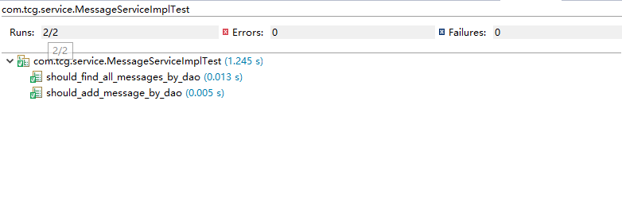

# TimeLine-2

+ 引入MySql数据库，重构大部分后端代码及全部测试代码
+ 后端使用spring boot框架及MySql数据库，实现timeline特性
+ 使用SpringBootTest + junit + Mockito进行测试
  + dao层测试类，MessageDaoImplTest
  + service层测试类，MessageServiceImplTest
  + controller层测试类，MessageControllerTest

##### 测试结果

+ dao层

+ service层

+ controller层

##### 提交界面 localhost:8080/submit

##### 浏览界面 localhost:8080/showResult

software testing